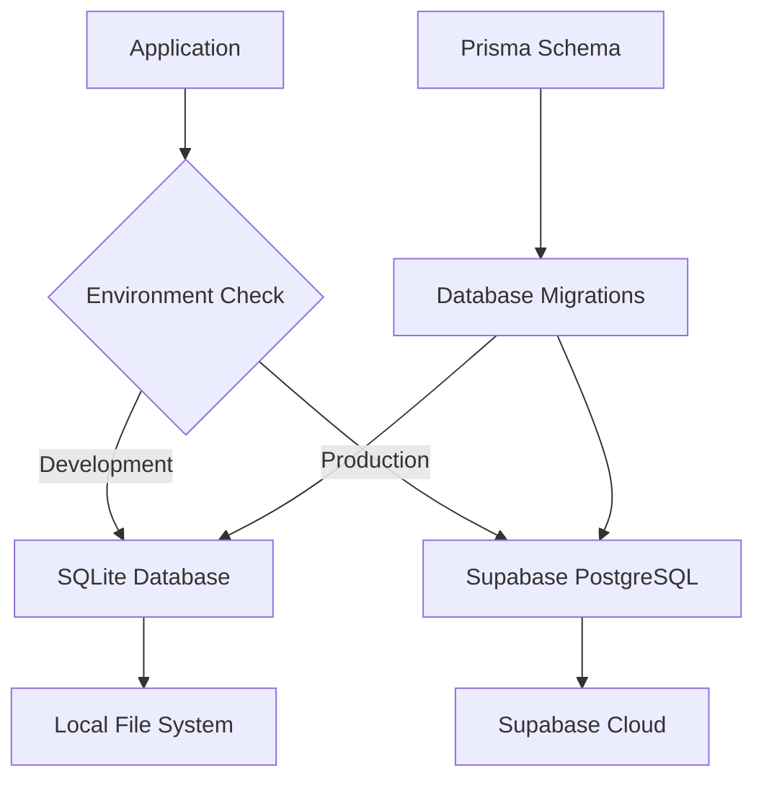

# Design Document

## Overview

This design establishes a robust environment separation strategy for a Next.js application with Prisma ORM, implementing SQLite for development and Supabase PostgreSQL for production. The solution includes automated deployment to Vercel with proper credential management and database migration handling.

## Architecture

### Environment Configuration Strategy

The application will use a multi-layered environment configuration approach:

1. **Base Configuration**: Common settings shared across environments
2. **Environment-Specific Overrides**: Database providers and connection strings
3. **Platform-Specific Variables**: Vercel environment variables for production
4. **Local Development Variables**: `.env.local` for development secrets

### Database Architecture



### Deployment Pipeline


## Components and Interfaces

### 1. Environment Configuration Manager

**Purpose**: Centralized environment variable management and validation

**Key Functions**:
- Environment detection and validation
- Database URL generation based on environment
- Required variable checking with clear error messages

### 2. Database Connection Handler

**Purpose**: Abstract database connections for different environments

**Key Functions**:
- Environment-aware Prisma client initialization
- Connection pooling configuration
- Error handling and retry logic

### 3. Migration Management System

**Purpose**: Handle database schema changes across environments

**Key Functions**:
- Cross-database migration compatibility
- Automatic migration execution in production
- Development database seeding

### 4. Deployment Configuration

**Purpose**: Vercel-specific deployment settings and build optimization

**Key Functions**:
- Build-time environment variable injection
- Production-specific optimizations
- Deployment health checks

## Data Models

### Environment Configuration Schema

```typescript
interface EnvironmentConfig {
  nodeEnv: 'development' | 'production' | 'test'
  databaseUrl: string
  databaseProvider: 'sqlite' | 'postgresql'
  nextAuthUrl: string
  nextAuthSecret: string
  supabaseConfig?: {
    url: string
    anonKey: string
    serviceRoleKey: string
  }
}
```

### Database Connection Configuration

```typescript
interface DatabaseConfig {
  provider: 'sqlite' | 'postgresql'
  url: string
  connectionLimit?: number
  ssl?: boolean
  schema?: string
}
```

## Error Handling

### Environment Variable Validation

- **Missing Variables**: Clear error messages indicating which variables are required
- **Invalid Values**: Validation with suggested correct formats
- **Environment Mismatch**: Warnings when development variables are used in production

### Database Connection Errors

- **Connection Failures**: Retry logic with exponential backoff
- **Migration Errors**: Detailed error reporting with rollback capabilities
- **Schema Mismatches**: Clear guidance on resolving schema conflicts

### Deployment Errors

- **Build Failures**: Detailed logs with specific error locations
- **Environment Variable Issues**: Pre-deployment validation
- **Database Migration Failures**: Rollback mechanisms and error reporting

## Testing Strategy

### Unit Tests

- Environment configuration validation
- Database connection handling
- Migration script execution
- Error handling scenarios

### Integration Tests

- End-to-end database operations in both environments
- Authentication flow testing
- API endpoint testing with different database backends

### Deployment Tests

- Vercel deployment simulation
- Environment variable injection testing
- Production database connection validation

## Implementation Details

### Prisma Schema Modifications

The Prisma schema will be updated to support both SQLite and PostgreSQL:

```prisma
generator client {
  provider = "prisma-client-js"
}

datasource db {
  provider = env("DATABASE_PROVIDER")
  url      = env("DATABASE_URL")
}
```

### Environment-Specific Configuration Files

1. **`.env.example`**: Template with all required variables
2. **`.env.local`**: Development-specific variables (gitignored)
3. **Vercel Environment Variables**: Production configuration via Vercel dashboard

### Database Migration Strategy

- Use Prisma's built-in migration system
- Ensure migrations are compatible with both SQLite and PostgreSQL
- Implement automatic migration execution in production builds

### Vercel Configuration

- **`vercel.json`**: Deployment configuration
- **Build Commands**: Custom build scripts for production
- **Environment Variables**: Secure credential management

## Security Considerations

### Credential Management

- No hardcoded secrets in codebase
- Environment-specific credential isolation
- Secure storage in Vercel environment variables

### Database Security

- Connection string encryption
- SSL enforcement for production connections
- Database access logging and monitoring

### Authentication Integration

- NextAuth.js configuration for both environments
- OAuth provider configuration management
- Session security across environments